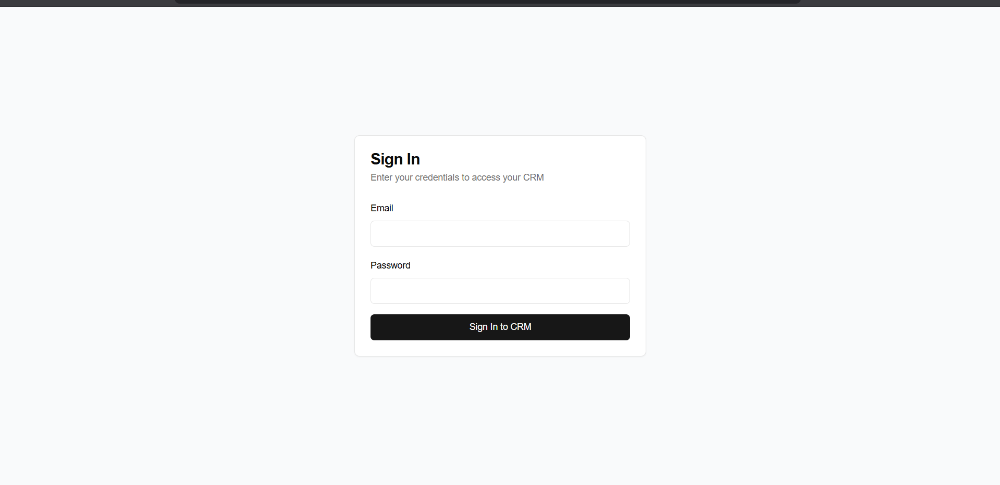
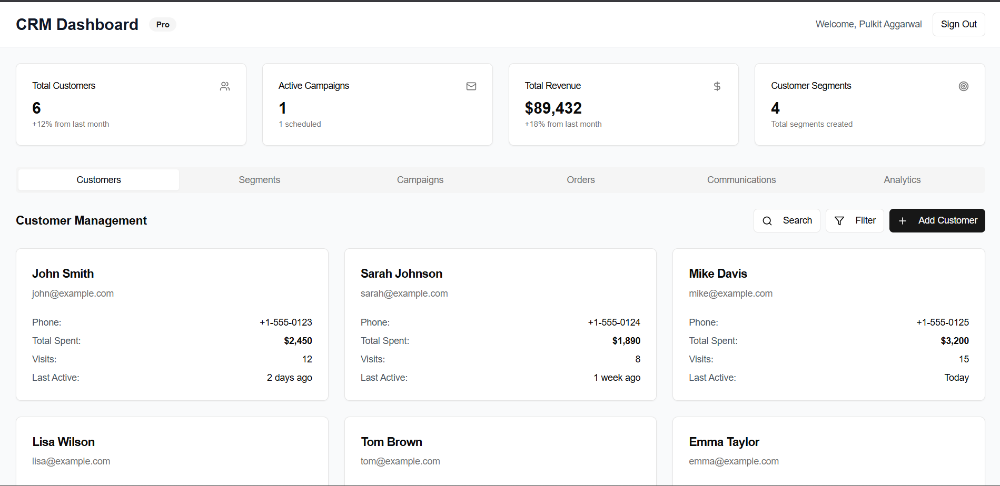
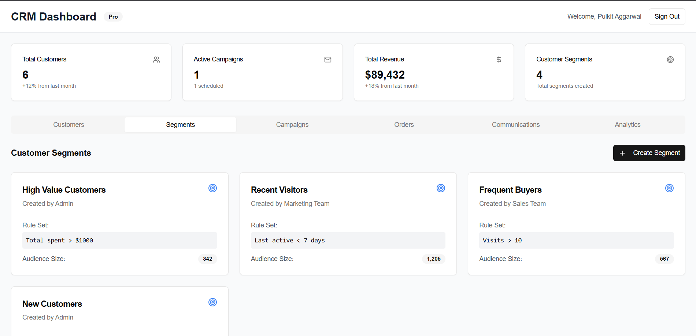
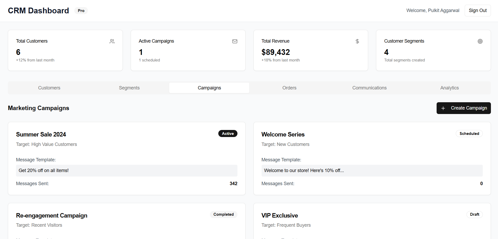
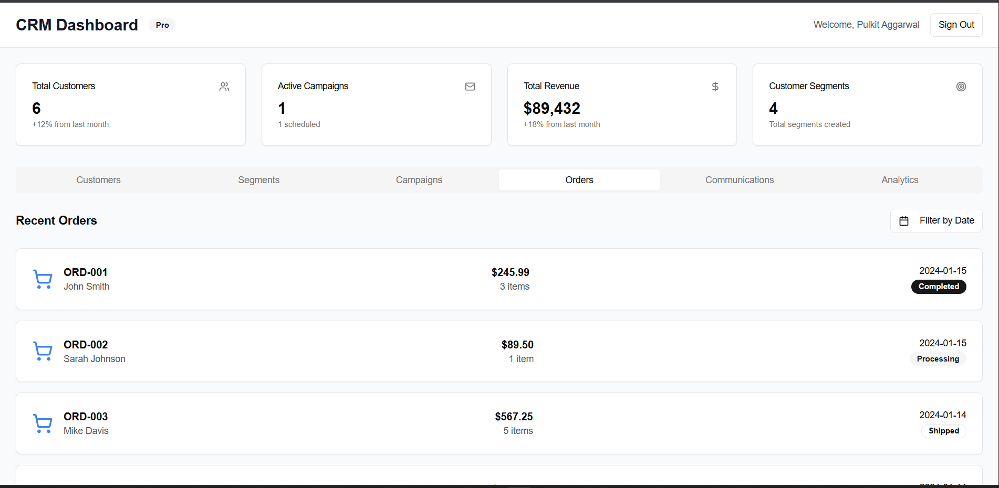
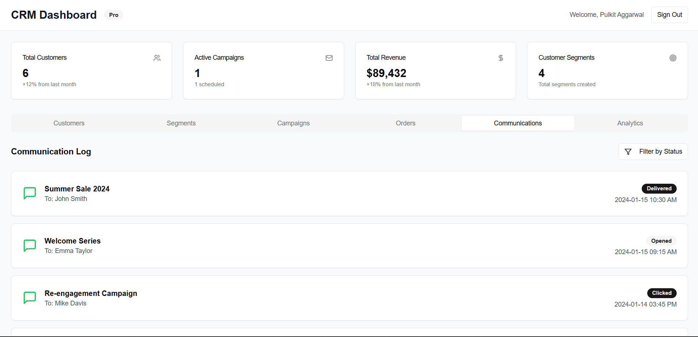
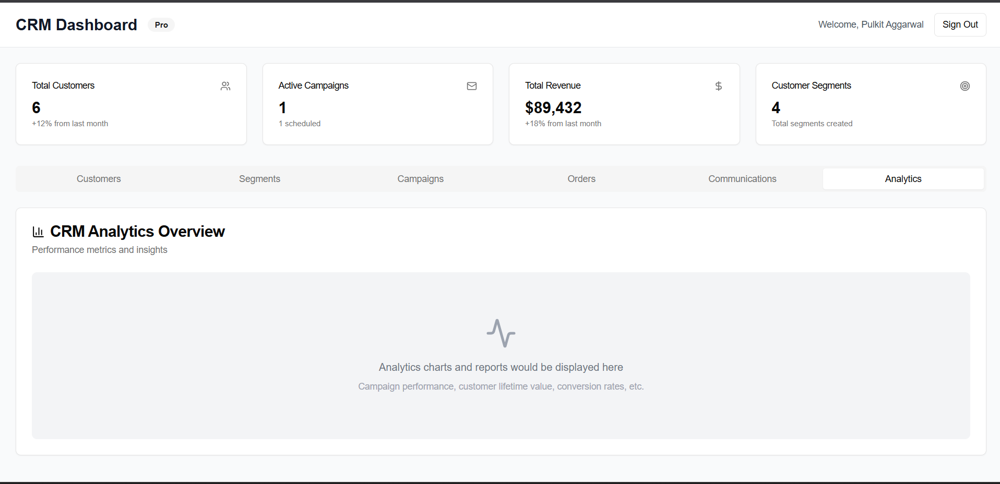
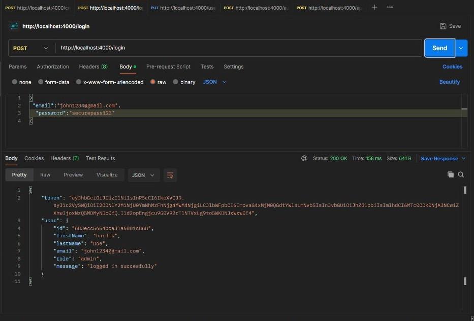
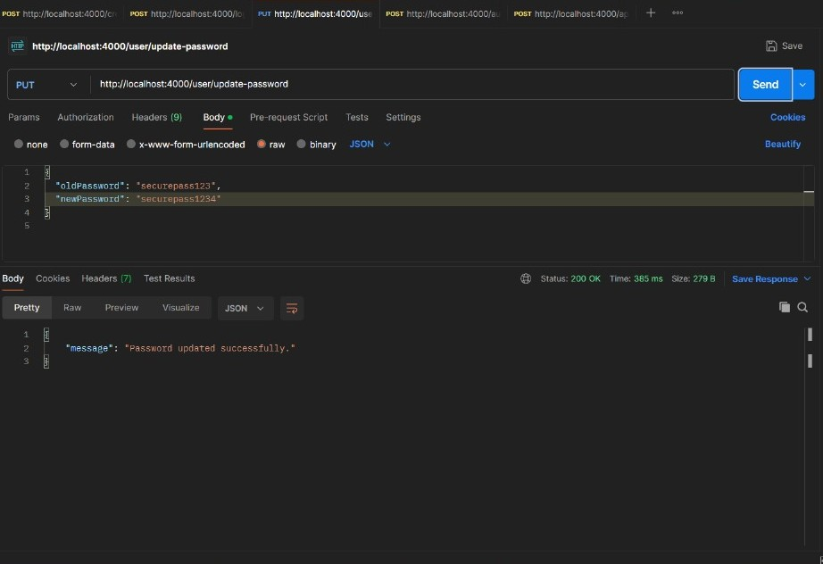
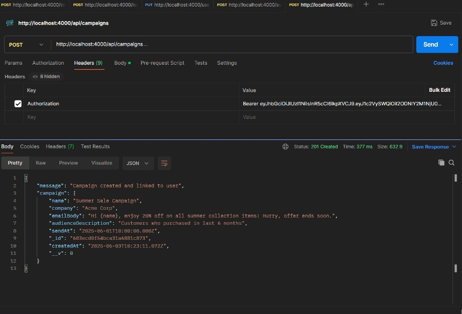

# CRM Project

A modern Customer Relationship Management (CRM) system with AI-powered campaign analysis and customer segmentation capabilities.

## Frontend Views

### Create Account Page

Simple and intuitive account creation process for new users.

### Sign In

Secure authentication system with email/password and Google OAuth options.

### Customer Management

View and manage customer details, including contact information, spending history, and activity metrics.

### Customer Value Analysis

Track and analyze customer value metrics, spending patterns, and engagement levels.

### Campaign Management

Create and manage marketing campaigns with customizable message templates and target segments.

### Orders Overview

Track and manage customer orders, view order history, and monitor transaction status.

### Communication Log

Track all customer communications, message delivery status, and engagement metrics.

### Analytics View

Comprehensive analytics dashboard showing key business metrics, customer insights, and campaign performance indicators.

## Backend API Testing Using Postman


Testing user authentication endpoints including login and registration.


Testing CRUD operations for customer data management.


Testing campaign creation, update, and management endpoints.


Testing analytics data retrieval and processing endpoints.

## Architecture

```mermaid
erDiagram
    USERS {
        string id
        string name
        string email
        string google_id
    }
    SEGMENTS {
        string id
        string name
        string created_by
        json rule_set
        int audience_size
    }
    CAMPAIGNS {
        string id
        string segment_id
        string created_by
        json message_template
    }
    CUSTOMERS {
        string id
        string name
        string email
        string phone
        float total_spent
        int visits
        date last_active_date
    }
    COMMUNICATION_LOG {
        string id
        string campaign_id
        string customer_id
        string status
        datetime timestamp
    }
    ORDERS {
        string id
        string customer_id
        float amount
        json items
        datetime order_date
    }

    USERS ||--o{ SEGMENTS : creates
    USERS ||--o{ CAMPAIGNS : creates
    SEGMENTS ||--o{ CAMPAIGNS : triggers
    CAMPAIGNS ||--o{ COMMUNICATION_LOG : logs
    CUSTOMERS ||--o{ COMMUNICATION_LOG : receives
    CUSTOMERS ||--o{ ORDERS : has
```

## Tech Stack

### Backend
- Node.js with Express
- MongoDB for database
- OpenAI GPT-3.5 for campaign analysis
- Passport.js for authentication
- JWT for session management

### Frontend
- Next.js 14
- TypeScript
- Tailwind CSS
- Shadcn/ui components
- React Query for data fetching

## AI Tools Integration

> Note: AI features are currently implemented in the backend only and pending frontend integration.

The system uses OpenAI's GPT-3.5 Turbo model (backend/Config/openai.js) for:
- Campaign performance analysis
- Customer segmentation suggestions
- Engagement optimization recommendations

Access is provided through authenticated API endpoints with proper error handling and secure configuration.

## Local Setup Instructions

### Prerequisites
- Node.js (v18 or higher)
- MongoDB
- OpenAI API key
- Google OAuth credentials (for social login)

### Backend Setup
1. Navigate to the backend directory:
   ```bash
   cd backend
   ```

2. Install dependencies:
   ```bash
   npm install
   ```

3. Create a .env file:
   ```
   MONGODB_URI=your_mongodb_uri
   JWT_SECRET=your_jwt_secret
   OPENAI_API_KEY=your_openai_api_key
   GOOGLE_CLIENT_ID=your_google_client_id
   GOOGLE_CLIENT_SECRET=your_google_client_secret
   ```

4. Start the server:
   ```bash
   npm start
   ```

### Frontend Setup
1. Navigate to the frontend directory:
   ```bash
   cd frontend
   ```

2. Install dependencies:
   ```bash
   npm install
   ```

3. Create a .env.local file:
   ```
   NEXT_PUBLIC_API_URL=http://localhost:3000
   ```

4. Start the development server:
   ```bash
   npm run dev
   ```

## Features

- User authentication with email/password and Google OAuth
- Customer management and profiling
- Campaign creation and management
- AI-powered campaign analysis
- Customer segmentation with rule-based targeting
- Communication logging and tracking
- Order management and history
- Real-time customer analytics

## Known Limitations & Assumptions

1. **Performance**
   - System is designed for small to medium businesses
   - Current architecture supports up to 10,000 customers
   - Campaign analysis has a rate limit based on OpenAI API

2. **Security**
   - Assumes backend runs in a secure environment
   - API keys must be properly secured in production
   - Frontend assumes HTTPS in production

3. **Data Privacy**
   - Compliant with basic data protection requirements
   - Customer data should be handled according to local regulations
   - No built-in data encryption at rest

4. **Integration Limitations**
   - Limited to email-based communications
   - No direct integration with external CRM systems
   - Manual data import/export functionality

## Future Improvements

1. Add support for SMS and other communication channels
2. Implement real-time notifications
3. Add bulk import/export features
4. Enhance AI capabilities with custom model training
5. Add multi-language support
6. Implement advanced reporting and analytics

## License

This project is licensed under the MIT License - see the [LICENSE](LICENSE) file for details.
